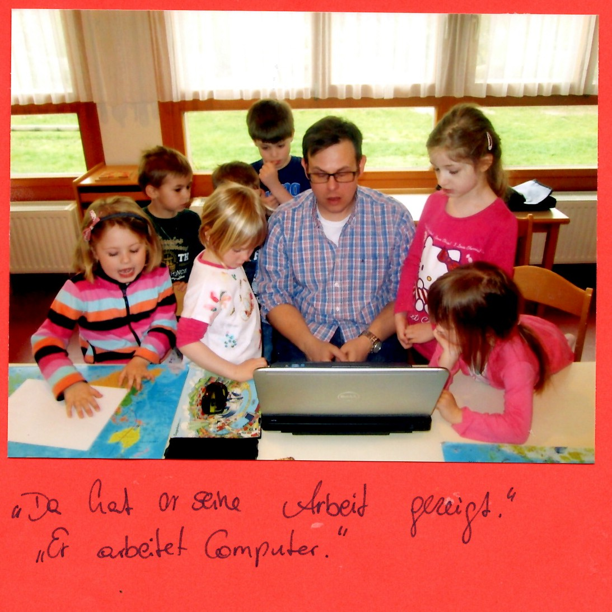

# ki(nder)ga(rden)-simple-server

> How does one explain to kindergarden-kids what your job is about?

I was offered to talk about my job at the kindergarden. This is how i managed to excite them for "computers".

I prepared this project and brought my laptop, tablet and mobile with me. That got their immediate attention. Before i started anything up i explained to them about those different "computers" - that are hardware factors - and how they are visually different.

Next i asked them how many of each the kids have at home by hand sign. I counted the numbers and noted them down.

After that i presented them the web page on the laptop and on the tablet. As it was a larger group some stood behind me on the laptop and some behind the tablet in the other direction. 

That web page displayed those hardware factors as icons and a count, intially 0. Each hardware factor inside the same lower section, which changed on-click. Asked the oldest kid to read the 0 number to the group.

No i told the kids that i want their numbers to appear on that web page. Therefore i had to explain to the computer what i want first by inputting, telling them that reading and writing is important to work with computers.

I altered the web page and reloaded it on the laptop and tablet. Asked the oldest kid to read the number, so the group  noticed the effect.

Now i told them that i can color style the web page too. Asked them by hand sign what their favorite color is. Updated again the web page. An interesting discussion followed. As some colors where not exactly the one they expected (used html color code).

Finally i asked them if they had any questions. And was asked if i can compute the weather. Offset for a second, i asked them what makes "weather" up and how we can record that.  

Presentation note: For presenting on the tablet i span a local wifi-network on my Ubtunu latop. For instruction see  http://ubuntuhandbook.org/index.php/2014/09/3-ways-create-wifi-hotspot-ubuntu/
